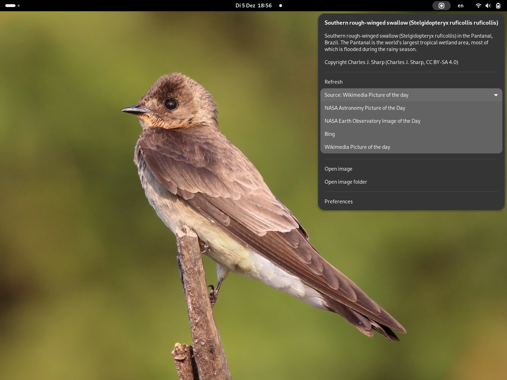

# Picture of the Day

> [!IMPORTANT]
> I consider this extension obsolete and no longer maintain it.
>
> Use the [Picture Of The Day app](https://flathub.org/apps/de.swsnr.pictureoftheday) instead.

Use a picture of the day from various sources as GNOME desktop background.



**Note:** Most images are protected by copyright; you may or may not be allowed to use or distribute them!

## Supported sources

- [NASA Astronomy Picture of the Day](https://apod.nasa.gov/apod/astropix.html)
- [NASA Earth Observatory Image of the Day](https://earthobservatory.nasa.gov/topic/image-of-the-day)
- [Bing](https://www.bing.com)
- [Wikimedia](https://commons.wikimedia.org/wiki/Main_Page)
- [Simon Stålenhag artwork](https://simonstalenhag.se/)

## Install

Install from [extensions.gnome.org](https://extensions.gnome.org/extension/6469/picture-of-the-day/).

**Note**: The mandatory review process for extensions.gnome.org can sometimes delay releases for a few days, in particular if the release contains larger changes.
Please do be patient, or use release file (see below) as an alternative.

Or download the latest ZIP file from [releases](https://github.com/swsnr/gnome-shell-extension-picture-of-the-day/releases),
and install with

```console
$ gnome-extensions install picture-of-the-day@swsnr.de.shell-extension.zip
```

## Configure

Use "Settings" in the Extension apps, or in the indicator menu. Or run

```console
$ gnome-extensions prefs picture-of-the-day@swsnr.de
```

## Credits and Acknowledgments

I'd like to thank the following people and projects without whom this extension would never have existed:

* [Elia Argentieri](https://github.com/Elinvention) for [gnome-shell-extension-nasa-apod](https://github.com/Elinvention/gnome-shell-extension-nasa-apod)
which was a great inspiration for this extension, and has served me well for years.
* Each and every person involved in the heroic effort to bring modern Javascript, and in particular ES modules, to GNOME Shell, which cummulated in the awesome GNOME 45 release.
This made extension development so much more fun.
* [ts-for-gir](https://github.com/gjsify/ts-for-gir) which, together with ES modules, finally brings the power of Typescript to GNOME Shell extensions, without which Javascript has become unbearable for me.
* The people behind <https://gjs-docs.gnome.org/> which is a great API reference for Gjs and all the libraries in its ecosystem, in one place, with a powerful search.
* [Evan Welsh](https://gitlab.gnome.org/ewlsh/) for their amazing work on the magnificent <https://gjs.guide/> whose [extensions section](https://gjs.guide/extensions/) helps so much in getting things right, and finding your way around extension development.
* [Javad Rahmatzadeh](https://gitlab.gnome.org/jrahmatzadeh), the author of [Just Perfection](https://gitlab.gnome.org/jrahmatzadeh/just-perfection), for their tireless reviewing of my extensions, and carefully dissecting all the flaws therein;  an ungrateful work which is so absolutely essential to keep the extension system in good shape.
* All the people on the GNOME Extensions, GJS, and libadwaita Matrix channels, for patiently answering all my questions.

## License

Copyright Sebastian Wiesner <sebastian@swsnr.de>

This program is subject to the terms of the Mozilla Public
License, v. 2.0.If a copy of the MPL was not distributed with this
file, You can obtain one at https://mozilla.org/MPL/2.0/.

Alternatively, this program may be used under the terms
of the GNU General Public License Version 2 or later, as described below:

This program is free software; you can redistribute it and/or modify
it under the terms of the GNU General Public License as published by
the Free Software Foundation; either version 2 of the License, or
(at your option) any later version.

This program is distributed in the hope that it will be useful,
but WITHOUT ANY WARRANTY; without even the implied warranty of
MERCHANTABILITY or FITNESS FOR A PARTICULAR PURPOSE.  See the
GNU General Public License for more details.
